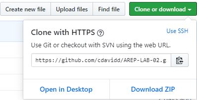

# AREP-LAB-02

Este programa implementa una linkedlist propia que se utilizara para calcular la media y desviación estándar de los datos a procesar, estos datos se recibiran mediante un servicio web con el uso spark y heroku.

## Empezando

Estas instrucciones ofrecerán una guía de como utilizar la copia del programa que usted podrá tener en su maquina local para fines de desarrollo y prueba.

### Prerrequisitos

**Java**

Se necesitara del java JDK 1.8, para verificar que se tiene abriremos nuestra terminal o consola de comando y ejecutaremos el siguiente comando:

```
java -version
java version "1.8.0_221"
Java(TM) SE Runtime Environment (build 1.8.0_221-b11)
Java HotSpot(TM) 64-Bit Server VM (build 25.221-b11, mixed mode)
```

En caso de no tenerlo se podra descargar de [java](https://www.oracle.com/technetwork/java/javase/downloads/jdk8-downloads-2133151.html)

**Maven**

Se necesitara de Maven para ejecutar el programa, para eso se verificara si se tiene con `mvn -v` en caso de no tenerlo se podrá hacer [aqui](https://maven.apache.org/install.html)

**Heroku**

Para correrlo localmente mediante heroku asegurece de terner el CLI de este con el comando `heroku --version`

```
heroku/7.37.0 win32-x64 node-v12.4.0
```

### Instalación

Para la instalación de nuestro programa, lo podremos hacer dándole en el botón "Clone or download"



Podremos copiar la URL y desde consola ejecutar el siguiente comando `git clone <URL>` o le damos en la opción Download ZIP

**Ejecución**

Para la ejecución del programa entraremos en la carpeta descargada o clonada _AREP-LAB-02/_, ya en esta ubicación desde consola ejecutaremos el siguiente comando `mvn package` en el cual sera para compilar y por ultimo ejecutaremos el siguiente comando `mvn exec:java` y abrimos la aplicacion en _localhost:4567/_

```
[INFO] Scanning for projects...
[INFO]
[INFO] -------------------< edu.escuelaing.arep:TallerWeb >--------------------
[INFO] Building TallerWeb 1.0-SNAPSHOT
[INFO] --------------------------------[ jar ]---------------------------------
[INFO]
[INFO] --- exec-maven-plugin:1.6.0:java (default-cli) @ TallerWeb ---
SLF4J: Failed to load class "org.slf4j.impl.StaticLoggerBinder".
SLF4J: Defaulting to no-operation (NOP) logger implementation
SLF4J: See http://www.slf4j.org/codes.html#StaticLoggerBinder for further details.
```

Si estamos desde ubuntu podremos ejecutar el comando `heroku local web` y se abrira en _localhost:5000/_

## Ejecutando las pruebas

Para ejecutar la pruebas se realizara mediante el siguiente comando `mvn test`

- Ejemplo de prueba.

```java

```

## Generar javaDocs

Para generar el javaDocs utilizaremos `mvn javadoc:javadoc`

## Autores

- Cristian López

## Licencia

- GNU General Public License v3.0
